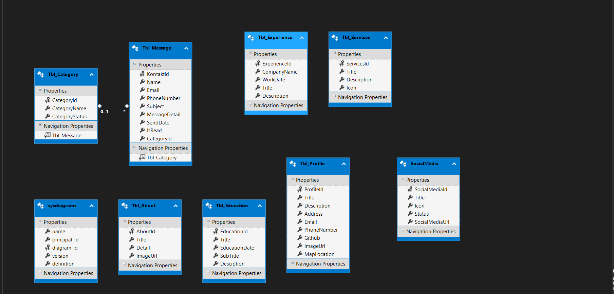
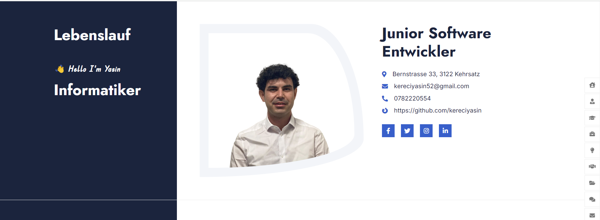
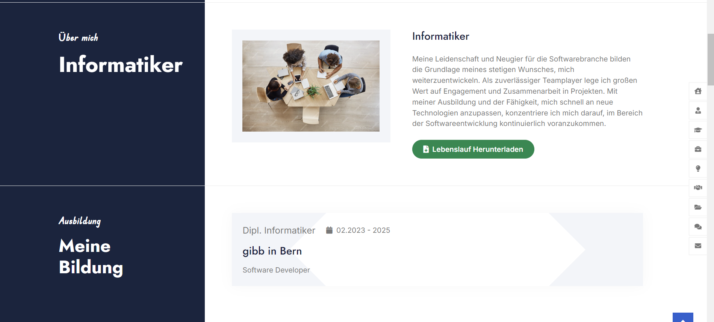
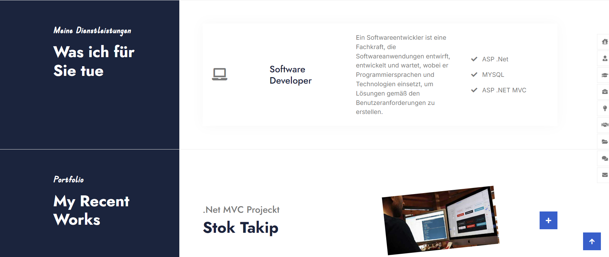
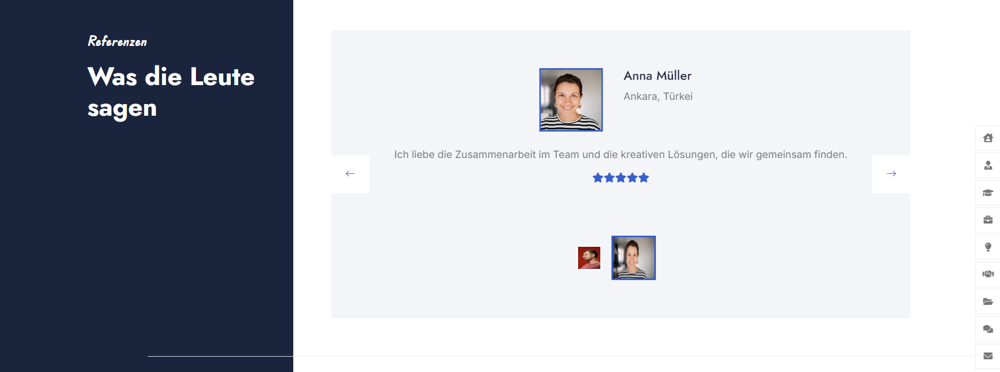
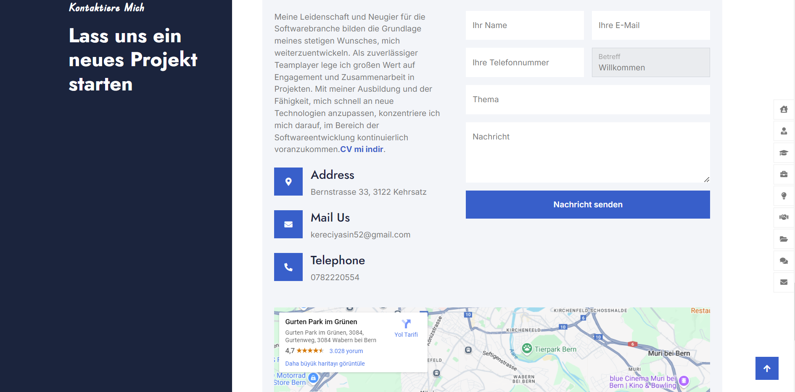

# Portfolio-Projekt

## 📋 Allgemeine Übersicht
✨ In diesem Projekt wurde ein klassischer Lebenslauf in eine dynamische Website umgewandelt.

💡 Der Benutzer kann alle seine Informationen dynamisch hinzufügen.

💻 Im Admin-Panel wurden Funktionen zum Hinzufügen/Löschen/Aktualisieren/Auflisten integriert.

🥮 Daten wurden mithilfe von Kreisdiagrammen und Statistiken visualisiert.

📑 Navigation zwischen den Seiten wurde durch eine Navbar und Sidebar ermöglicht.

📎 Download-Links für den Lebenslauf wurden hinzugefügt.

📍 Soziale Medien-Links wurden bereitgestellt.

💕 Eine Nachrichtenfunktion wurde für Besucher über ein Kontaktpanel erstellt.

## 🛠️ Verwendete Technologien
©️ Basierend auf dem ASP.Net MVC Framework

🔎 Entity Framework als ORM-Tool verwendet

💯 DB First Ansatz wurde implementiert

✔️ CRUD-Operationen wurden durchgeführt

🎪 Benutzeroberfläche wurde mit HTML, CSS und Bootstrap verbessert

🚀 LINQ-Abfragen wurden hinzugefügt

📚 Eine Datenbank wurde mit MSSQL Server erstellt

🔅 Daten wurden aus einem Dropdown-Menü abgerufen

🔨 Die Verwaltung des Seitenübergangs wurde durch die Verwendung von PartialViews erleichtert

📟 Die Paging-Struktur wurde verwendet, um die Anzeige der Fähigkeiten-Seite zu vereinfachen.

🌕 Diagramme wurden mit dem ChartJs-Plugin erstellt.

## 🖼️ Screenshots

### SQL

### Web Site

### 1. Admin Panel

### 2. Statistiken mit Diagrammen

### 3. Kontaktformular

